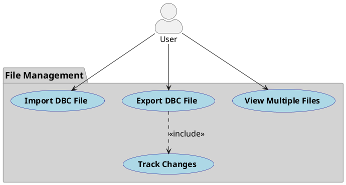
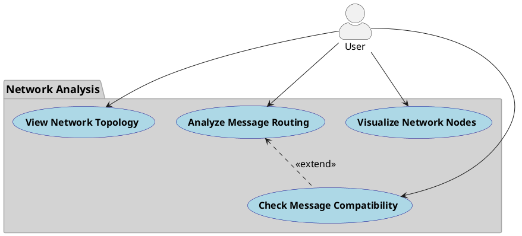
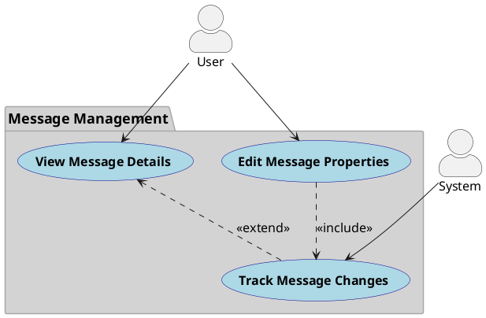
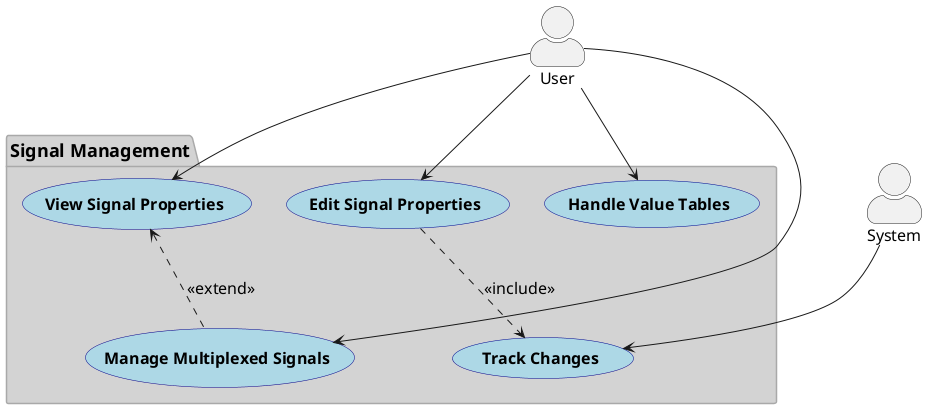
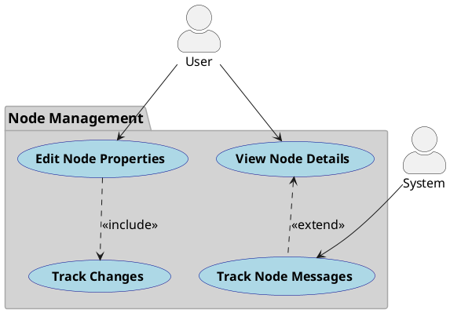
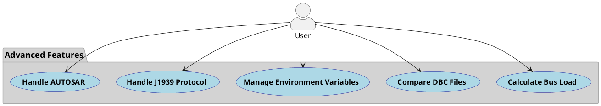
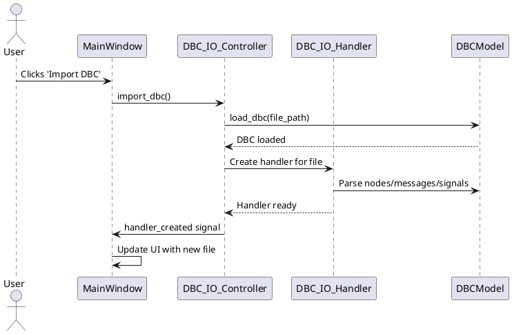
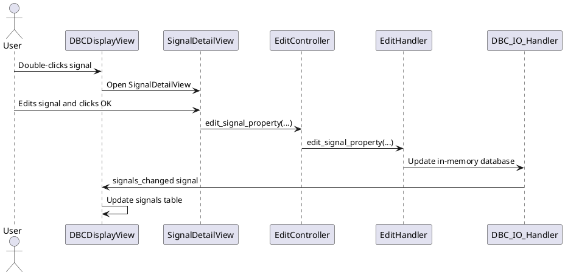
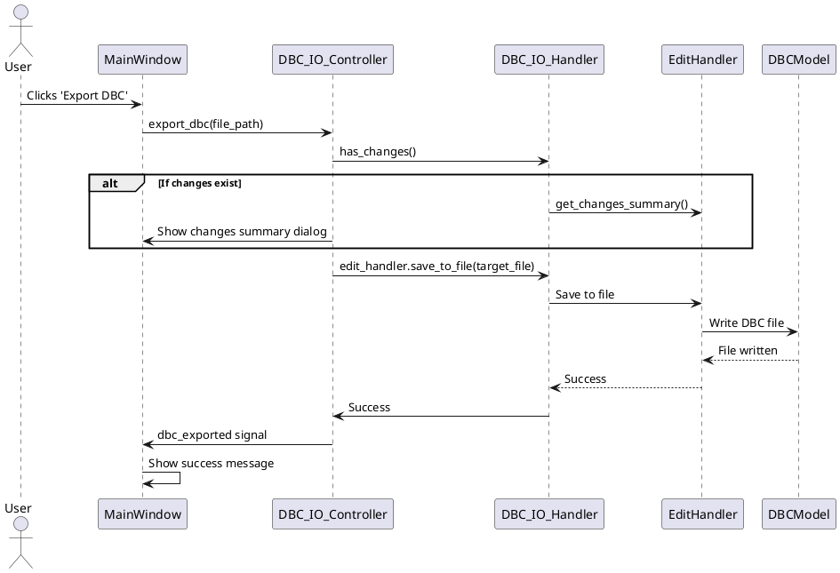
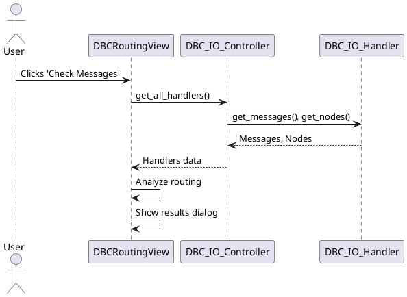

# DBC Master - CAN Database Management Tool

DBC Master is a comprehensive tool for managing and analyzing CAN database (DBC) files. It provides a user-friendly interface for viewing, editing, and analyzing CAN network configurations.

## Core Features

### 1. DBC File Management
- Import and load multiple DBC files
- Export DBC files with change tracking
- View and manage multiple DBC files simultaneously
- Open DBC files in separate windows for detailed analysis

### 2. Network Analysis
- View network topology with gateway nodes
- Analyze message routing between different CAN networks
- Check message compatibility and routing paths
- Visualize network nodes and their connections

### 3. Message Management
- View detailed message information including:
  - Frame IDs
  - Message length
  - Senders and receivers
  - Cycle time
  - Send type
  - Frame format (Standard/Extended)
  - CAN FD support
- Edit message properties
- Track message changes

### 4. Signal Management
- View and edit signal properties:
  - Start bit
  - Length
  - Byte order
  - Signed/Unsigned
  - Scale and offset
  - Minimum/Maximum values
  - Units
  - Comments
- Support for multiplexed signals
- Signal value tables and choices

### 5. Node Management
- View and manage network nodes
- Node properties including:
  - Node name
  - Comments
  - Address information
  - J1939 specific properties
  - AUTOSAR specific properties
- Track node message transmission and reception

### 6. Advanced Features
- Bus load calculation
- Message comparison between different DBC files
- Change tracking and history
- Support for J1939 protocol
- Support for AUTOSAR
- Environment variable management
- Value table management

### 7. User Interface Features
- Tree-based navigation
- Tabular data display
- Context menus for quick actions
- Multi-window support
- Status bar for operation feedback
- Export functionality with change summary

## Technical Details

### Supported Protocols
- Standard CAN
- CAN FD
- J1939
- AUTOSAR

### File Format Support
- DBC files
- Export to text format for change tracking

### Data Management
- In-memory database handling
- Change tracking and validation
- Automatic data structure updates
- Error handling and validation

## Usage

1. **Importing DBC Files**
   - Use the "Import DBC" button to load DBC files
   - Multiple files can be loaded simultaneously
   - Files can be opened in separate windows

2. **Viewing Network Information**
   - Use the tree view to navigate through messages, signals, and nodes
   - Select items to view detailed information in tables
   - Double-click items to open detailed views

3. **Editing**
   - Use context menus or double-click to edit items
   - Changes are tracked and can be reviewed before export
   - Validation is performed on all edits

4. **Analysis**
   - Use the "Route" feature to analyze message routing
   - Use the "Compare" feature to compare DBC files
   - Use the "Show Topology" feature to visualize the network

5. **Export**
   - Export modified DBC files
   - Review changes before export
   - Export change summaries to text files

## Requirements

- Python 3.x
- PyQt5
- cantools library
- Operating System: Windows/Linux/MacOS

## Module Architecture

### Model Layer

#### DBCModel (`model/dbc_model.py`)
The central data model that manages DBC file content using the cantools library.

**Methods:**
- `load_dbc(file_path)`: Loads a DBC file from a given path
- `get_dbc(file_path)`: Retrieves a loaded DBC database
- `remove_dbc(file_path)`: Removes a DBC file from the model
- `get_all_dbc_files()`: Returns a list of all loaded DBC file paths
- `export_dbc(source_file_path, target_file_path)`: Exports a DBC file to the specified path

**Signals:**
- `dbc_loaded`: Emitted when a DBC file is successfully loaded
- `dbc_error`: Emitted when there's an error loading a DBC file
- `dbc_exported`: Emitted when a DBC file is successfully exported

### Controller Layer

#### DBC_IO_Controller (`controller/DBC_IO_Controller.py`)
Manages the interaction between the model and view for DBC file operations.

**Methods:**
- `import_dbc(parent_window)`: Opens a file dialog to select and load a DBC file
- `export_dbc(file_path, parent_window)`: Opens a file dialog to select a location to export a DBC file
- `remove_dbc(file_path)`: Removes a DBC file from the model
- `get_handler(file_path)`: Returns a handler for a specific DBC file
- `get_all_handlers()`: Returns a list of all handlers

**Signals:**
- `handler_created`: Emitted when a new handler is created
- `handler_removed`: Emitted when a handler is removed
- `handlers_changed`: Emitted when the handlers list changes
- `dbc_exported`: Emitted when a DBC file is exported

#### DBC_IO_Handler (`controller/dbc_io_handler.py`)
Handles the operations for a specific DBC file, providing data to the views.

**Methods:**
- `load_dbc()`: Loads a DBC file into memory
- `get_database()`: Returns the DBC database
- `get_file_info()`: Gets information about the DBC file
- `parse_nodes()`: Parses all nodes from the DBC database
- `parse_messages()`: Parses all messages from the DBC database
- `parse_all_signals()`: Parses all signals from all messages
- `get_nodes()`: Returns all nodes in the DBC file
- `get_messages()`: Returns all messages in the DBC file
- `get_signals()`: Returns all signals in the DBC file
- `unload()`: Unloads the DBC file from memory
- `cleanup()`: Cleans up resources
- `is_valid()`: Checks if the handler has a valid DBC file loaded
- `get_file_path()`: Returns the path to the DBC file
- `get_node_messages(node_name)`: Gets messages associated with a node
- `get_node_signals(node_name)`: Gets signals associated with a node

**Signals:**
- `nodes_changed`: Emitted when nodes list changes
- `messages_changed`: Emitted when messages list changes
- `signals_changed`: Emitted when signals list changes

#### BusLoadCalculator (`controller/bus_load_calculator.py`)
Provides calculations for CAN bus load analysis.

### View Layer

#### MainWindow (`view/main_window.py`)
The main application window that contains the DBC list and display views.

**Methods:**
- `import_dbc()`: Invokes the controller to import a DBC file
- `export_dbc()`: Invokes the controller to export the selected DBC file
- `on_handlers_changed(handlers)`: Updates UI when handlers list changes
- `on_handler_removed(file_path)`: Handles UI updates when a handler is removed
- `on_handler_selected(handler)`: Displays selected handler data
- `open_dbc_in_new_window(handler)`: Opens a DBC file in a new window
- `on_handler_export(handler)`: Handles export request from context menu
- `on_dbc_exported(file_path)`: Updates UI after successful export

#### DBCListView (`view/dbc_listview.py`)
Displays a list of loaded DBC files.

**Signals:**
- `handler_selected`: Emitted when a handler is selected
- `handler_removed`: Emitted when a request to remove a handler is made
- `handler_open_in_new_window`: Emitted when a request to open a handler in a new window is made
- `handler_export`: Emitted when a request to export a handler is made

#### DBCDisplayView (`view/dbc_display_view.py`)
Displays the content of a DBC file in a structured view, including trees and tables.

**Methods:**
- `setup_ui()`: Sets up the UI components
- `update_signals_table(signals)`: Updates the signals table with data
- `update_messages_table(messages)`: Updates the messages table with data
- `update_nodes_table(nodes)`: Updates the nodes table with data
- `on_tree_item_clicked(item)`: Handles tree item clicks
- `update_display(handler)`: Updates the display with information from a handler
- `clear_display()`: Clears all displayed information
- `show_bus_load_calculator()`: Shows the bus load calculator dialog
- `on_export_clicked()`: Handles export button click

**Signals:**
- `export_requested`: Emitted when the user requests to export the displayed DBC file

#### Detail Views
- `SignalDetailView (`view/signal_detail_view.py`)`: Shows detailed information about a signal
- `MessageDetailView (`view/message_detail_view.py`)`: Shows detailed information about a message
- `NodeDetailView (`view/node_detail_view.py`)`: Shows detailed information about a node
- `BusLoadDialog (`view/bus_load_dialog.py`)`: UI for the bus load calculator

## Signal Flow Between Modules

### Model to Controller
- `DBCModel.dbc_loaded` → `DBC_IO_Handler._on_model_loaded`: Notifies when a DBC file is loaded
- `DBCModel.dbc_error` → `DBC_IO_Handler._on_model_error`: Passes error messages during loading
- `DBCModel.dbc_exported` → `DBC_IO_Controller.dbc_exported`: Notifies when a DBC file is exported

### Controller to View
- `DBC_IO_Controller.handlers_changed` → `MainWindow.on_handlers_changed`: Updates the UI when handlers list changes
- `DBC_IO_Controller.handler_removed` → `MainWindow.on_handler_removed`: Updates the UI when a handler is removed
- `DBC_IO_Controller.dbc_exported` → `MainWindow.on_dbc_exported`: Updates the UI when a DBC file is exported
- `DBC_IO_Handler.nodes_changed` → Updates displays of nodes
- `DBC_IO_Handler.messages_changed` → Updates displays of messages
- `DBC_IO_Handler.signals_changed` → Updates displays of signals

### View to Controller
- `DBCListView.handler_selected` → `MainWindow.on_handler_selected`: Notifies when a handler is selected in the list
- `DBCListView.handler_removed` → `DBC_IO_Controller.remove_dbc`: Requests removal of a DBC file
- `DBCListView.handler_open_in_new_window` → `MainWindow.open_dbc_in_new_window`: Requests to open a file in a new window
- `DBCListView.handler_export` → `MainWindow.on_handler_export`: Requests to export a DBC file
- `DBCDisplayView.export_requested` → `DBCWindow.on_export_requested`: Requests to export the displayed DBC file

## Technical Requirements

- Python 3.x
- PyQt5
- cantools library

## Getting Started

1. Install the required dependencies: `pip install -r requirements.txt`
2. Run the application: `python main.py`
3. Use the "Import DBC" button to load a DBC file
4. Navigate the tree view to explore nodes, messages, and signals
5. Double-click on items to view detailed information
6. Use the "Export DBC" button to save a DBC file to a new location

## Conclusion

DBC Master is a comprehensive tool for working with DBC files, providing detailed views into CAN network specifications. With its MVC architecture, it offers a clean separation of concerns while maintaining robust communication between components through the signal-slot mechanism. The application's rich feature set makes it an essential tool for automotive engineers and CAN network specialists working with vehicle network configurations.

## Signal Editing Flow

The application provides a comprehensive signal editing system with change tracking and validation. Here's a detailed breakdown of the signal editing process:

### 1. Opening Edit Dialog

- The signal editing process starts from `SignalDetailView` when the user clicks the "Edit" button
- `SignalEditDialog` is created with the following parameters:
  - Current signal name
  - Current signal length
  - Current start bit
  - Complete signal data dictionary
  - DBC handler reference
  - Parent widget reference

### 2. Edit Dialog UI

The edit dialog provides fields for editing all signal properties:
- Basic Properties:
  - Name
  - Length (bits)
  - Start Bit
  - Byte Order (little_endian/big_endian)
  - Is Signed
  - Scale
  - Offset
  - Minimum
  - Maximum
  - Unit
  - Comment
- Advanced Properties:
  - Receivers (multi-select list of available nodes)
  - Multiplexer Settings:
    - Is Multiplexer checkbox
    - Multiplexer ID
  - Value Table:
    - Table of raw values and descriptions
    - Add/Remove value buttons

### 3. Validation Process

When the user clicks OK, the following validations are performed:
1. Name Validation:
   - Checks for empty names
   - Validates DBC name format
   - Checks for duplicate names in the message
2. Signal Position Validation:
   - Checks for signal overlap with other signals
   - Validates against message constraints
3. Value Validation:
   - Validates min/max values
   - Checks for duplicate values in value table
4. Receivers Validation:
   - Warns if no receivers are selected

### 4. Change Tracking

The application maintains a detailed change tracking system:

1. Local Changes:
   - `SignalDetailView` keeps a copy of the original signal data
   - Each edit operation creates a new copy of the signal data
   - Changes are tracked using the `signal_edited` signal

2. Global Change Tracking:
   - `ChangeTracker` class maintains a list of all changes
   - Each change includes:
     - Timestamp
     - Message name
     - Signal name
     - Detailed list of changed properties
   - Changes are tracked for:
     - Signal property modifications
     - Signal deletions

### 5. Edit Process Flow

1. User makes changes in the edit dialog
2. On OK click:
   - Validations are performed
   - If valid, changes are applied through `EditController`
   - `EditController` delegates to `EditHandler`
   - `EditHandler` updates the in-memory database
   - Changes are tracked in `ChangeTracker`
   - UI is updated to reflect changes

### 6. Export Process

When exporting changes:
1. The `EditHandler` converts the in-memory database to DBC format
2. Changes are written to the target file
3. Change tracker is cleared after successful export
4. UI is updated to reflect the saved state

### 7. Error Handling

The system includes comprehensive error handling:
- Validation errors are shown to the user
- Database operation errors are caught and displayed
- Invalid changes are prevented
- User is notified of any issues during the process

### 8. Data Flow

1. UI Layer:
   - `SignalDetailView`: Displays signal details
   - `SignalEditDialog`: Handles user input
   - `SignalValuesDialog`: Shows value table

2. Controller Layer:
   - `EditController`: Manages edit operations
   - `EditHandler`: Performs actual database modifications
   - `ChangeTracker`: Tracks all changes

3. Model Layer:
   - In-memory database representation
   - Original database copy for comparison
   - DBC file export functionality

## UML Diagrams

### File Management Use Case Diagram

---

### Network Analysis Use Case Diagram

---

### Message Management Use Case Diagram

---

### Signal Management Use Case Diagram

---

### Node Management Use Case Diagram

---

### Advanced Features Use Case Diagram

### Import DBC File Sequence Diagram

### Edit Signal Sequence Diagram

### Export DBC File Sequence Diagram

### Routing Analysis Sequence Diagram

</rewritten_file> 